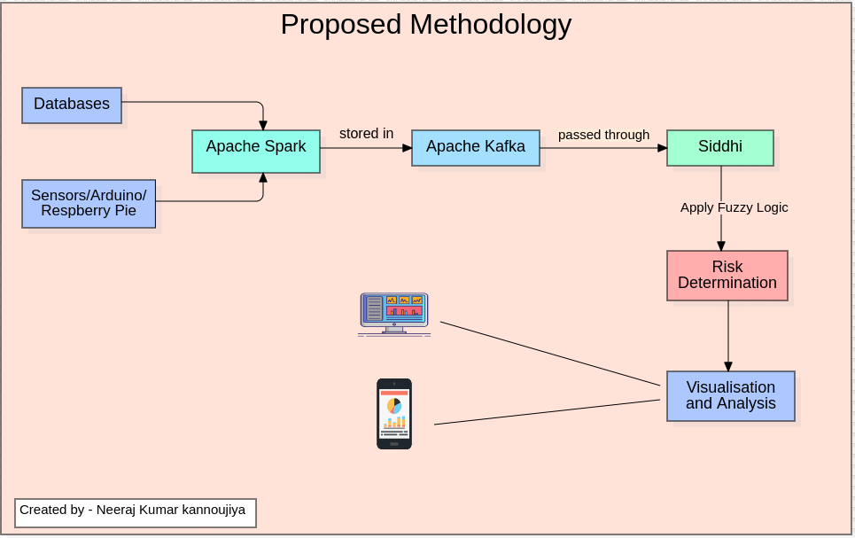

# Complex Event Processing For Cardiovascular Disease Detection Using TDD


## 📌 Overview
Cardiovascular diseases (CVDs) are a leading cause of mortality worldwide. This project introduces a **Fuzzy Rule-Based Intelligent CVD Prediction System** using **Complex Event Processing (CEP)**, **Apache Kafka**, **Apache Spark**, and **Siddhi CEP Engine**. The system efficiently analyzes real-time health data and predicts risk levels using fuzzy logic.

---

## 🚀 Features
✅ Real-time data streaming using Kafka & Spark  
✅ Fuzzy rule-based decision-making  
✅ CEP-based event analysis for rapid prediction  
✅ Scalable & fault-tolerant architecture  
✅ Test-driven development (TDD) for reliability  
✅ User-friendly dashboard for visualization  

---

## 📜 System Architecture


1. **Event Producer**: Collects CVD-related data from sensors, repositories, or APIs.  
2. **Event Processing**: Uses Kafka for message handling, Spark for processing, and Siddhi CEP for complex event pattern detection.  
3. **Event Consumer**: Displays predictions in a real-time dashboard.  

---

## 📂 Tech Stack
- **Backend**: Java, Spring Boot, Kafka, Spark Streaming
- **CEP Engine**: Siddhi CEP
- **Frontend**: HTML, CSS, Bootstrap
- **Build Tool**: Gradle
- **Testing**: JUnit, Mockito

---

## ⚙️ Installation & Setup
### Prerequisites
Ensure you have the following installed:
- Java 11
- Apache Kafka 3.1.0
- Apache Spark 3.5.4
- Gradle
- IntelliJ IDEA

### Setup Instructions
```bash
# Clone the repository
git clone https://github.com/your-repo/cvd-prediction.git
cd cvd-prediction

# Build the project
gradle build

# Start Kafka
bin/zookeeper-server-start.sh config/zookeeper.properties &
bin/kafka-server-start.sh config/server.properties &

# Run Spark Streaming App
spark-submit --class com.cvd.MainApp --master local[2] build/libs/cvd-prediction.jar
```

---

## 🧪 Test-Driven Development (TDD) Implementation
We follow a TDD approach, ensuring robust functionality with unit and integration tests.

### Running Tests
```bash
# Run all unit tests
gradle test
```

### Sample Test (JUnit + Mockito)
```java
@Test
void testFuzzyRiskCalculation() {
    FuzzyEngine fuzzyEngine = new FuzzyEngine();
    double riskScore = fuzzyEngine.calculateRisk(120, 85, 200);
    assertEquals(0.75, riskScore, 0.01);
}
```

---

## 📊 Dashboard Preview


The real-time dashboard provides **CVD risk analysis** categorized into:
- Very Low Risk
- Low Risk
- Medium Risk
- High Risk
- Very High Risk

---

## 📖 References
- WHO Cardiovascular Disease Risk Factors
- Apache Kafka & Spark Streaming Documentation
- Siddhi CEP Engine Docs

---

## 📬 Contact
📧 Email: your.email@example.com  
🔗 GitHub: [your-github-profile](https://github.com/your-github)  
🌐 LinkedIn: [your-linkedin-profile](https://linkedin.com/in/yourprofile)  

**⭐ If you like this project, give it a star on GitHub!**
